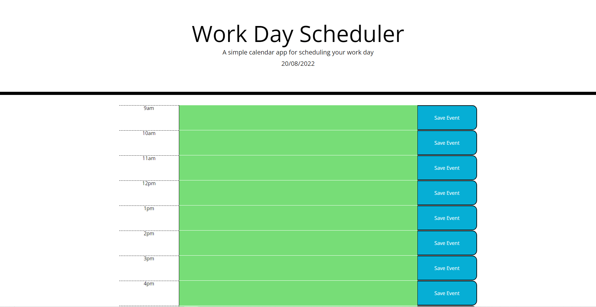

# Scheduler

## Description

Provide a short description explaining the what, why, and how of your project. Use the following questions as a guide:

- As I start my new job, I decided to create this work day schedular to help with my time management. This will allow me to pace myself throughout the work day and create a list to work towards during the day. I've learned that I can stay on task better when I have small goals to work towards. Having a schedular lets me stay on task as well as show my employer my thought process for the day. 
- This application solved my problem wandering off mentally and helps me stay on task, as well as giving me deadlines for certain tasks like completing tickets given to me during the work day.
- By completing this word day schedular, I learned how to use moment.js to compare times during the day to change the colors of the text areas to indicate if my time has passed or if my task is still due.

## Snippet

## Deployed application link

https://neuy16.github.io/Scheduler/